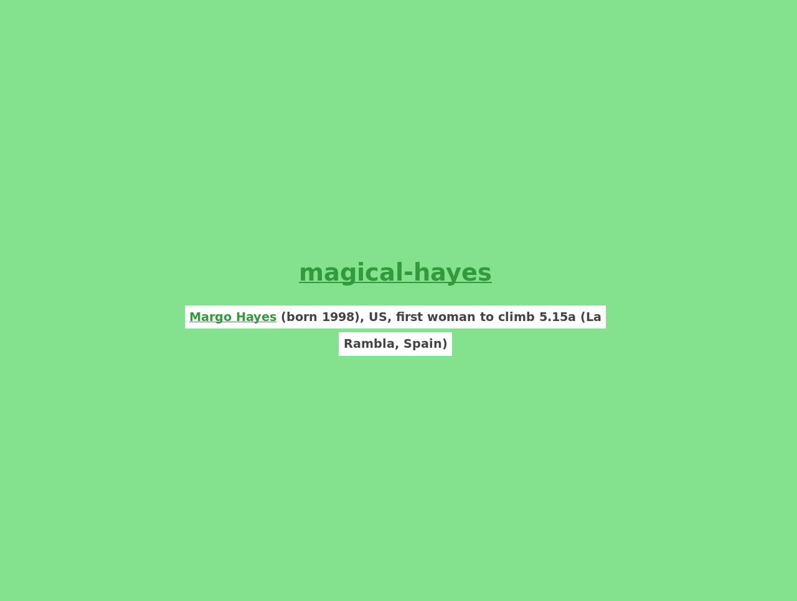
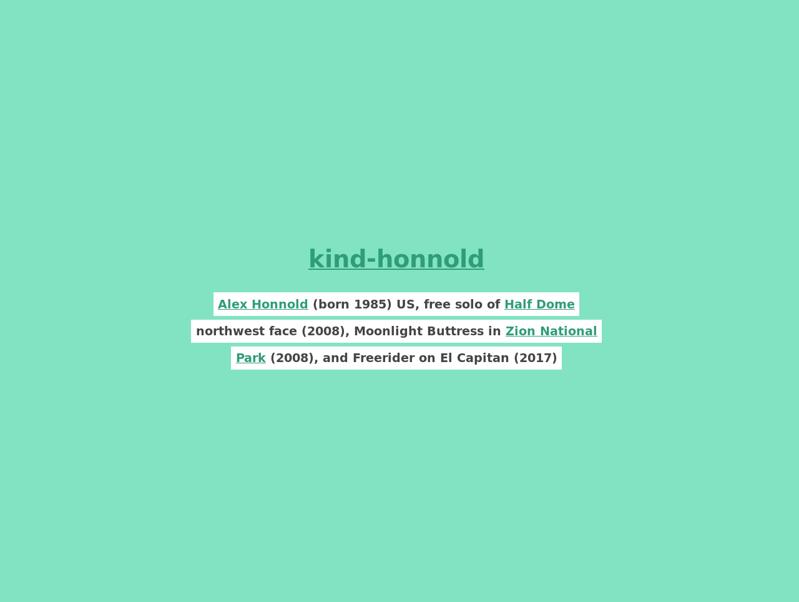

# climbing-route-name-generator

A name generator inspired by Docker container names

---



If you've ever worked with Docker you might have been pleasantly surprised by container names such as `furious_einstein`, `agitated_curie`, `wizardly_lovelace`, and `romantic_darwin`. 

The code responsible for generating names such as these [(names-generator.go)](https://github.com/moby/moby/blob/master/pkg/namesgenerator/names-generator.go) works by pairing a long list of adjectives together with a list of last names.

I wanted to write a tool that generates similar strings, but with a climbing flair, such as `beautiful_honnold`, `amazing_sharma`, and `cool_hill` and get the route setters at my local climbing gym to use it to name our indoor routes so me and my friends could have an easier time referring to routes when we aren't on site.

However, I am much too lazy to write down all of these last names by hand. And instead, I wanted to automagically scrape as many of them as I could off of the internet instead. Conveniently, Wikipedia has a page listing several well-known [climbers and mountaineers](https://en.wikipedia.org/wiki/List_of_climbers_and_mountaineers) that we can, of course, scrape.

In this repository, you'll find,

1. A Jupyter Notebook for scraping Wikipedia for suitable names, and
2. a small website for rendering these out.

# Building and Running

If you do not already have Docker installed then [begin by doing that first.](https://docs.docker.com/v17.12/install/)

Afterwards, run the notebook interactively through `make run-notebook` if you want to experiment with the scraping
code on your own.

If you just want to generate some sweet sweet route names, then run `make climbers.js` and open `index.html` in your
browser.

## Easter egg

If you want to generate some names for a climber in particular, you can append `?name=` together with the climber
name of your choice in your web-browser. If possible, the page will render out a route name seeded using the name
you provided. If not, it'll default back to rendering out a random name for a random climber.

For instance, visiting

```
file://path/to/repo/index.html?name=Alex Honnold
```

will display a page akin to,



whilst visiting

```
file://path/to/repo/index.html?name=Allberg
```

will give a random route name along with the pertinent description.

## Getting some dope screens

If you'd like to generate out some screen-shots to admire then you running `python3 demo.py` will (assuming
you have Selenium and the `geckodriver` on hand) create a directory called `img` with a few desktop- and 
mobile-renderings of the page.

## Cleaning things up without nuking the entire catalogue

Later, if you need to clean things up, `make clean` will appease you.

# Demos

Here are a few samples (mobile- and desktop)


